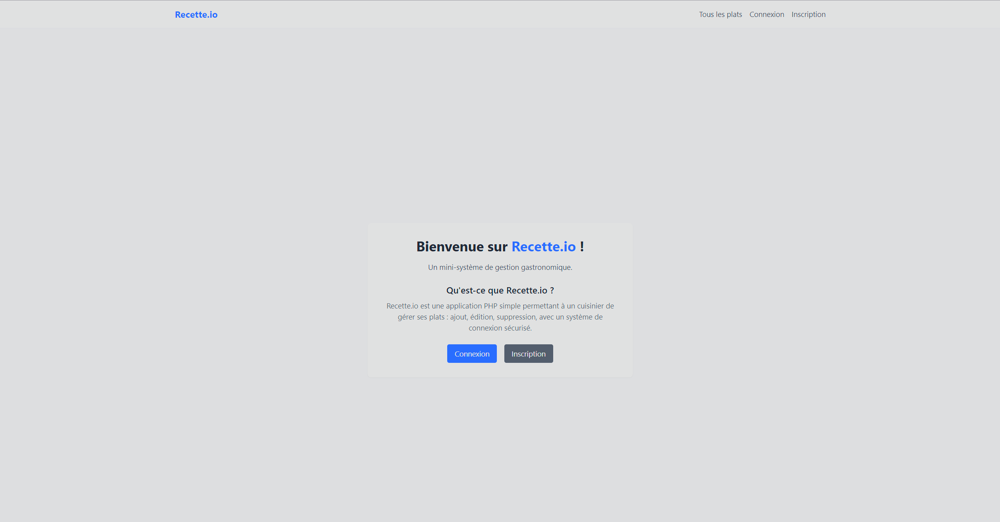
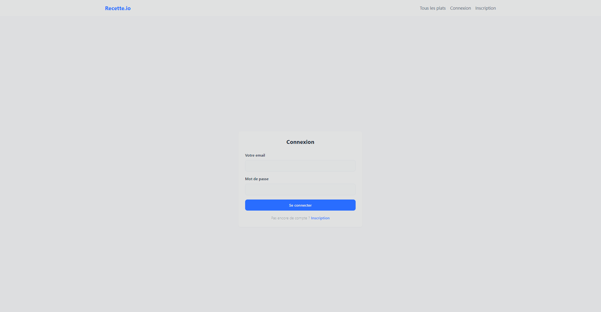
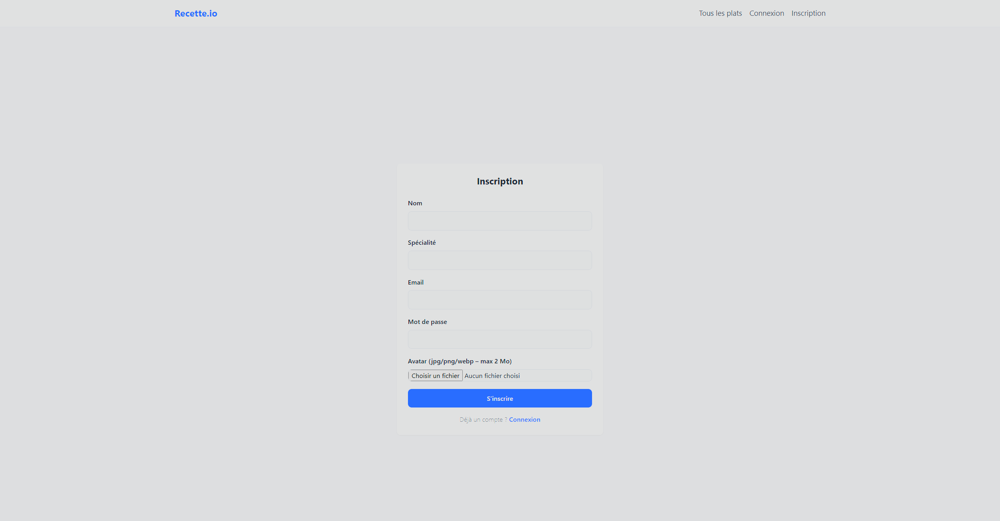
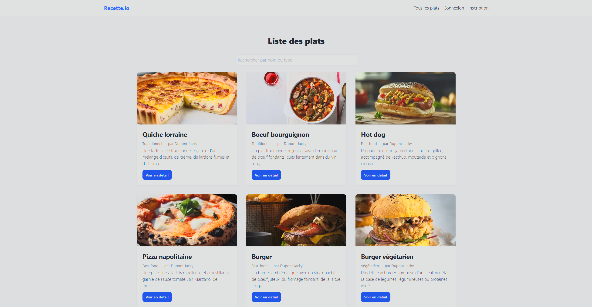

# 🍽️ Mini-Gestion Cuisine ~ Olivier RIVIERE
Bienvenue dans mon projet d’évaluation PHP/MySQL ! 👨‍🍳 Ce mini-système de gestion permet d’administrer une base de données gastronomique avec une interface simple, une authentification sécurisée et des interactions CRUD complètes.

## 🌟 Fonctionnalités
🧑‍🍳 Gestion des cuisiniers : inscription, connexion, modification du profil (email, mot de passe, avatar).

🍛 Gestion des plats : ajout, affichage, modification et suppression des plats (CRUD complet).

🔐 Authentification : système de connexion sécurisé avec mot de passe hashé.

🎨 Design responsive : interface propre et moderne grâce à Tailwind CSS.

## 🚀 Technologies Utilisées
🐘 PHP : langage serveur principal.

🗄️ MySQL : gestion de la base de données relationnelle.

💡 PDO : requêtes préparées sécurisées.

🖼️ Tailwind CSS : design moderne et responsive.

📦 MVC simplifié : séparation du code en views/, controllers/, models/.

## Screenshots

## 📝 Licence
Projet réalisé dans le cadre d'une évaluation de formation. Libre à consultation, non destiné à un usage en production.

## 🔗 Liens utiles
- 💻 [Live Portfolio](https://portfolio-olivier-riviere.vercel.app/)
- 📧 [Contact Me](mailto:olivier.riviere.dev@gmail.com)
- 🌐 [LinkedIn Profile](https://www.linkedin.com/in/olivierriviere/)